<p align="center">
  
</p>

<h1 align="center">BookScope · 书鉴</h1>

<p align="center">
  A tool for people who read long books. Every "the book says…" the AI gives you is checked character-by-character against the source; only matches are shown, each stamped with a 「鉴」(verify) seal.
</p>

<p align="center">
  <a href="https://github.com/moyu-good/BookScope/actions"></a>
  <a href="https://www.python.org/"></a>
  <a href="LICENSE"></a>
</p>

<p align="center">
  <a href="README.md">中文（full docs）</a> · English · <a href="https://moyu-good.github.io/BookScope/">Live demo</a>
</p>

<p align="center">
  
</p>

---

## What it is

Drop a long book (epub / txt / pdf) into your browser and ask it open questions, or run any of 20+ built-in lenses: character graphs and arcs, timelines, pacing and narrative curves, foreshadow tracking, subplot weaves, consistency scans, an evidence-anchored close-reading view, and more.

It runs locally on your own AI account. The book text goes straight to the provider you pick (DeepSeek by default); there's no server in between, so nothing here ever touches your book or your key.

**Live demo**: [moyu-good.github.io/BookScope](https://moyu-good.github.io/BookScope/) — a finished analysis of *Romance of the Three Kingdoms* you can click through, no install and no key. For your own book, clone and run it locally.

## Why it's different

Today's AIs casually invent "the source says XX" — it sounds real, and you can't go back and check every line.

BookScope's whole job is that check: every quote the model produces is verified against the book by code. Matches are shown and stamped with a 「鉴」seal; mismatches are dropped. Judgement calls (contradictions, foreshadowing, technique) follow the same rule — if the evidence doesn't hold up in the source, it isn't said. 鉴 means *to verify*; it's the point of the project, not a feature on the side.

> The UI is Chinese-first (中文优先 is a project invariant). This is a short English entry point; the full docs are in Chinese.

## Quick start

Requires Python 3.14+ and Node.js.

```bash
git clone https://github.com/moyu-good/BookScope.git
cd BookScope
pip install -e ".[dev]"
python -m textblob.download_corpora

uvicorn bookscope.api.app:create_app --factory --reload --port 8000
# in another shell
cd web && npm install && npm run dev          # http://localhost:5173
```

Open `http://localhost:5173`, add your LLM key in settings, upload a book, and ask. Default model: DeepSeek `deepseek-v4-flash`.

## Bring your own key

No vendor key is bundled. Eight providers are preset: DeepSeek (default), GLM, Qwen, Kimi, OpenAI, Gemini, and Grok over OpenAI-compatible endpoints, plus Anthropic native. Pick one and the base URL fills itself in. Your key stays in the browser and goes straight to the provider. No telemetry.

## How it works

A light index is built on upload. At query time the agent reads the source live and verifies every citation:

- fits the context window → the whole book goes into the prompt, behind a stable prefix cache that saves tokens on repeat questions
- too large → BM25 + vector hybrid retrieval

## Docs

Full docs are in Chinese: [README](README.md) · [User Guide](docs/USER_GUIDE.md) · [Architecture](docs/ARCHITECTURE.md) · [Contributing](CONTRIBUTING.md).

## License

[MIT](LICENSE)
