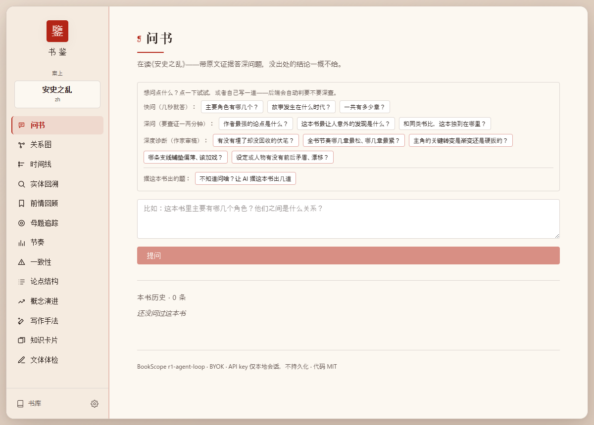
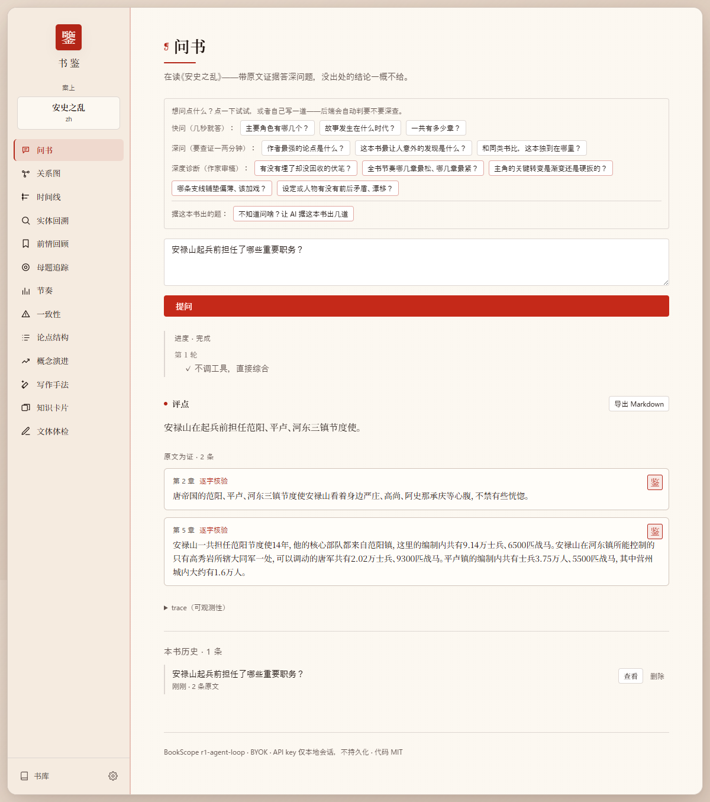

# 书鉴 · BookScope

[](https://github.com/moyu-good/BookScope/actions)
[](https://www.python.org/)
[](LICENSE)

中文 · [English](README.en.md)

> 把一本长书丢进浏览器,问它、拆它、查它——**每个结论都指回原文,核验过才显示,没出处的不编。**



上传一本书(小说、史书、论文、理论书都行),问任意深问题,或用十三个现成的功能画人物关系图、理时间线、查伏笔、扫前后矛盾。

跟"和 PDF 聊天"那类工具不一样的就一点:**每条引用都由程序拿去跟原文逐字比对,对上了才盖一枚「鉴」印显示;模型编的引用当场露馅。** 名字里的「鉴」,就是这个核验的印。

这也是它在 ChatGPT 失手处有用的原因——你没发表的草稿、上周的论文、冷门理论书,ChatGPT 没读过、只能猜;书鉴每次现场翻原文。而且自带 key、本地跑、不要 GPU,你的稿子不出门。

## 看它跑

问书:答案钉在原文,核验过的盖「鉴」印。



人物关系图:可拖动,连线越粗 = 关系越近,每条边点得到原文。


点任何功能,都看得到它读了多少字、花了多少 token、跑了多久。


## 十三个功能

左栏一栏切换,一次做一件事。除"问书"是自由问答,其余都是一键(或填一个词)就跑:

| 功能 | 干什么 |
|------|--------|
| 问书 | 带原文证据答任意深问题,引用逐条核验 |
| 关系图 | 人物 / 概念关系网,可拖动、按亲疏调远近,每条边点得到原文 |
| 时间线 | 全书事件按真实时序理清,多线、倒叙也还原 |
| 节奏曲线 | 逐章看张力——哪几章松、哪几章是高潮 |
| 一致性 | 扫全书前后矛盾(第 5 章左撇子、第 80 章用右手),两处对照,编的滤掉 |
| 实体回溯 | 输一个人 / 物 / 地点,看它在全书每次出现 |
| 前情回顾 | 告诉它你读到第几章,只回顾到此——后文物理上看不到,零剧透 |
| 母题追踪 | 追一个主题 / 意象在全书的复现 |
| 论点结构 | 拆非虚构书的论证骨架:主张什么、靠什么撑 |
| 概念演进 | 输一个概念,看它在全书怎么一步步发展 |
| 写作手法 | 列作者的写作手法 + 原文例子 |
| 知识卡片 | 出知识点卡 + 苏格拉底自测题 |
| 文体体检 | 扫用词重复 / 视角越界 / 支线失踪 |

判断类的功能(矛盾、伏笔、手法……)都焊了一道硬规矩:证据过不了原文核验,这条就丢——宁可少说,不编。

## 上手

需要 Python 3.14+ 和 Node.js。

```bash
git clone https://github.com/moyu-good/BookScope.git
cd BookScope
pip install -e ".[dev]"
python -m textblob.download_corpora       # 一次性 NLTK 资源

uvicorn bookscope.api.app:create_app --factory --reload --port 8000   # 后端

# 另开一个终端
cd web && npm install && npm run dev       # 前端，http://localhost:5173
```

打开 `http://localhost:5173` → 左下角设置里填你的 LLM key → 传一本 epub / txt / pdf → 开问。默认用 DeepSeek 的 `deepseek-v4-flash`,国内能直连、最便宜。

## 自带 key（BYOK）

代码里不内置任何厂商 key,你在设置里填自己的。预置了八家:DeepSeek(默认)、智谱 GLM、通义千问、Kimi、Anthropic、OpenAI、Gemini、Grok——选了厂商自动填好官方接口地址。除 Anthropic 外都走 OpenAI 兼容协议,所以任何 OpenAI 兼容的服务(含自建代理)都能接。

你的 key 只存在浏览器本地、随请求直发你选的厂商,不经过任何服务器。没有遥测。

## 怎么工作的

不提前把书嚼碎做静态展示,而是上传时只建轻索引,提问时让 agent 现场翻原文、逐条核验:

```
上传(一次性)            提问(每次)
  解析 epub/txt/pdf       route：判断走快路径还是 agent 循环
  按章切块 + 建索引        agent 现场查原文、给答案 + 引用
                          verify_citations：每条引用跟原文逐字比对
                            → 编的标记 verified=false，盖不了「鉴」印
```

塞得进上下文的书默认整本进模型(配稳定前缀缓存,重复问命中率 ≥90%);超大书回退 BM25 + 向量混合检索。全程普通 CPU 能跑。细节见 [架构总图](docs/ARCHITECTURE.md),每个功能怎么用见 [用户手册](docs/USER_GUIDE.md)。

## 跟同类的区别

| | 它们 | 书鉴 |
|---|------|------|
| chat-with-PDF / RAG（[pdfGPT](https://github.com/bhaskatripathi/pdfGPT)、[AnythingLLM](https://github.com/topics/document-question-answering)） | 引用检索到的块,不回头核验 | 引文逐字比对原文,编的露馅 |
| NotebookLM 开源替代（[Khoj](https://github.com/khoj-ai/khoj)、[SurfSense](https://github.com/MODSetter/SurfSense)） | 通用文档问答 | 针对一本长书的十三种结构化深读 |
| 给小说家的 AI（NovelCrafter 等） | 多闭源、偏"帮你写" | 开源、偏"帮你读 / 审",不绑某家云 |

## 技术栈

Python 3.14 · FastAPI · Pydantic v2 · React 19 + Vite + TypeScript + Tailwind v4 · provider-agnostic（BYOK,默认 DeepSeek）· FAISS + BM25 · 1083 个 pytest 用例 · 纯 CPU,不要 GPU。

## 文档

- [用户手册](docs/USER_GUIDE.md) —— 十三个功能逐个怎么用、怎么配 key、怎么读答案
- [架构总图](docs/ARCHITECTURE.md) —— 上传 / 查询两条链路、引用核验、缓存
- [架构决策记录](docs/architecture-decisions/) —— 每个关键技术决策怎么拍的
- [贡献指南](CONTRIBUTING.md)

## License

[MIT](LICENSE)
