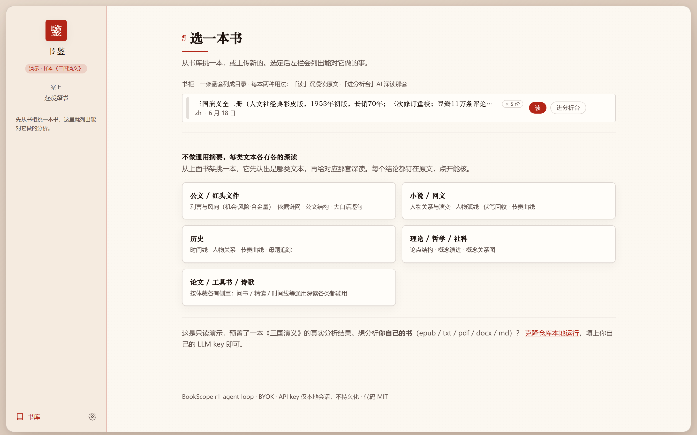
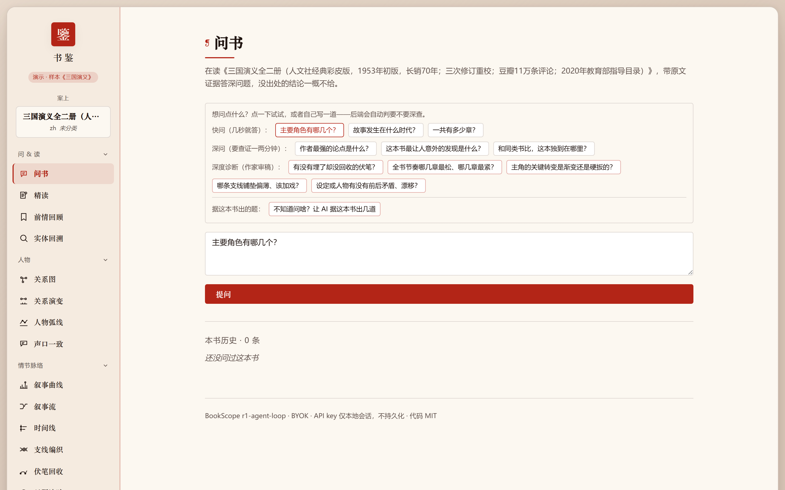
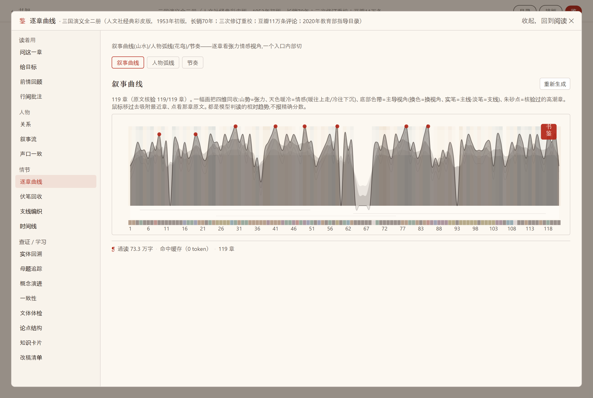
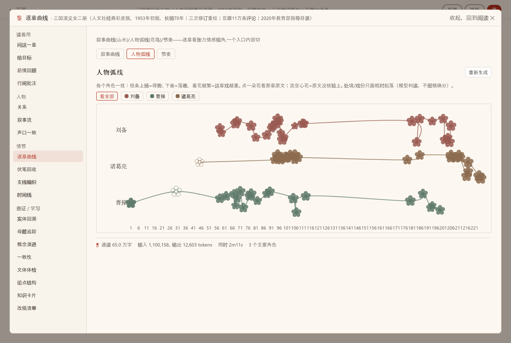
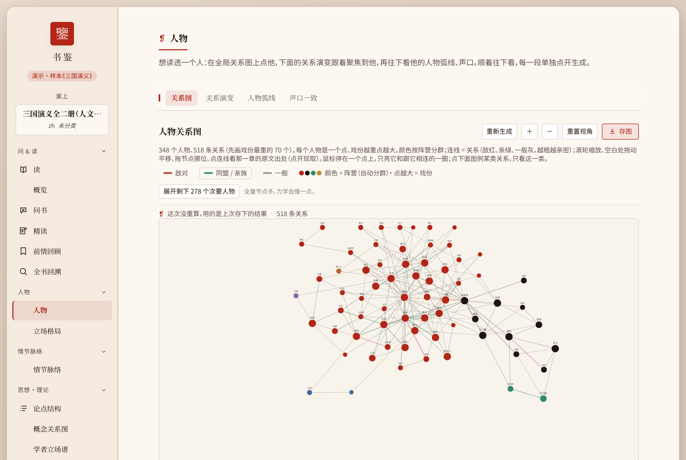
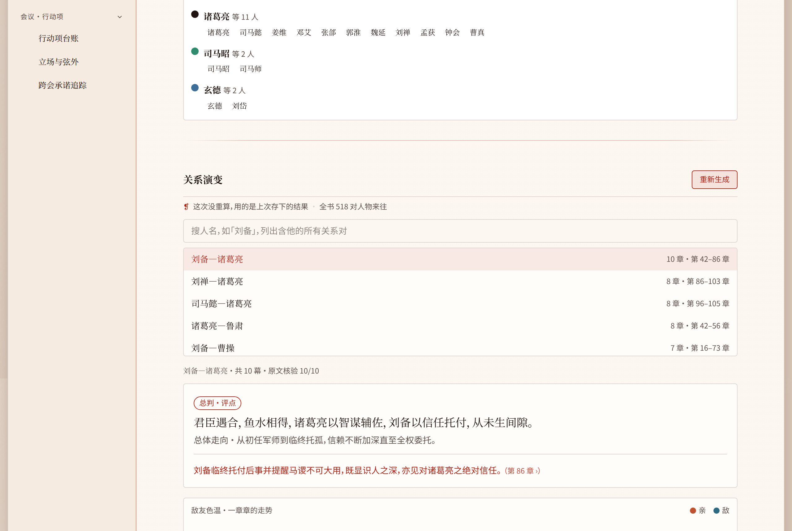
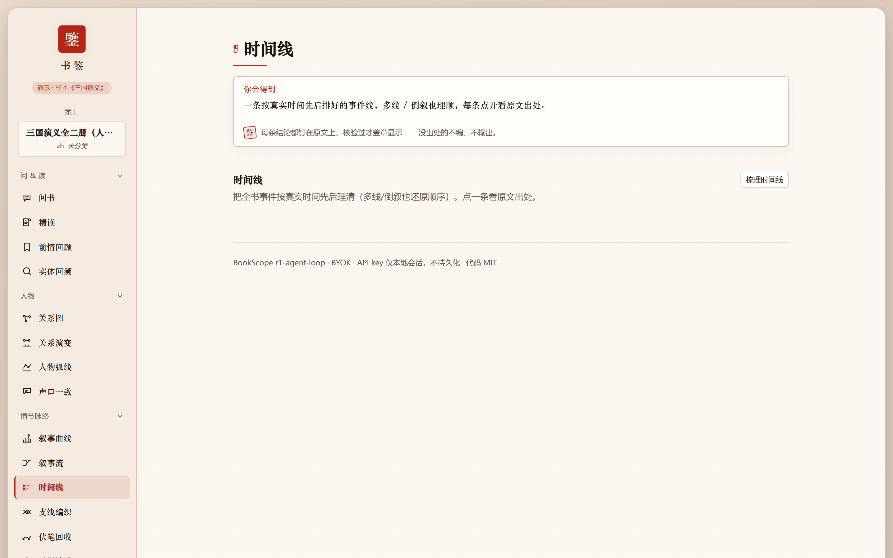
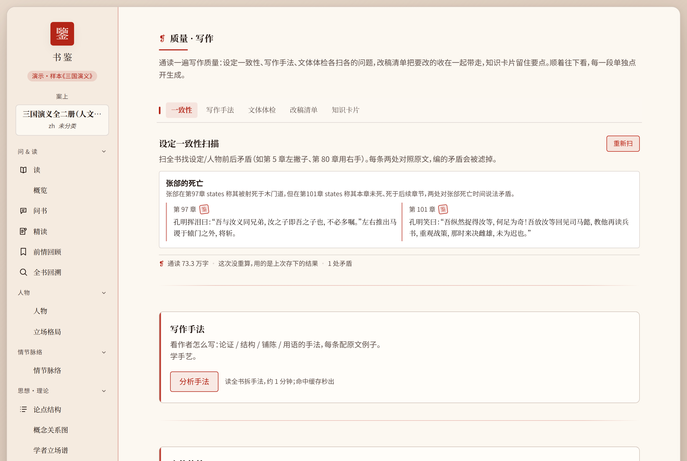
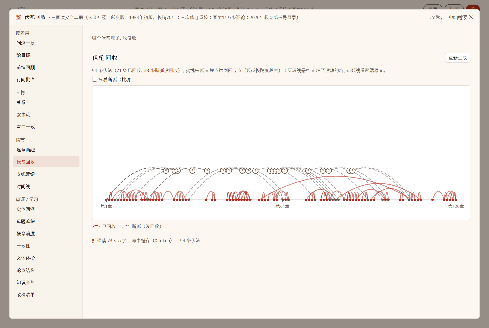
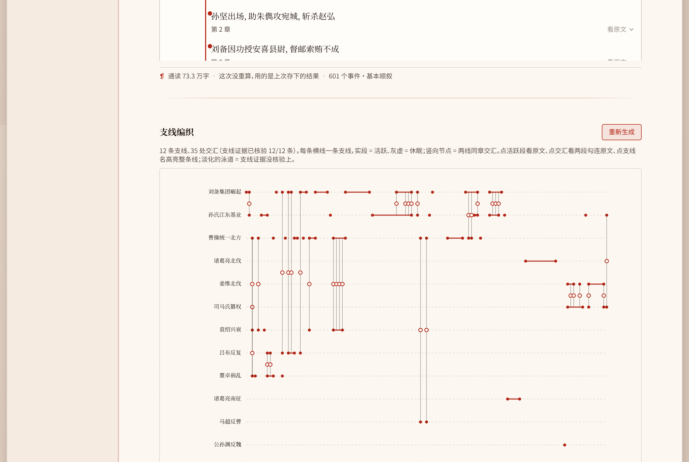

<p align="center">
  
</p>

<h1 align="center">书鉴 · BookScope</h1>

<p align="center">
  <b>一个轻量的本地长文本工具</b>：把几百万字的书/公文/论文，变成可核验、可交互、可追问的 HTML 报告。
</p>

<p align="center">
  <a href="https://github.com/moyu-good/BookScope/actions"></a>
  
  
  
</p>

<p align="center">
  中文 · <a href="README.en.md">English</a> · <a href="https://moyu-good.github.io/BookScope/">在线 Demo</a>
</p>

---

## 它是什么

**不是平台，不是服务器，是一个跑在你电脑上的工具。**

- 本地起一个轻量服务，浏览器里拖文件就能用；
- 也可以完全不用浏览器：一条 CLI 命令直接出报告、提问、跨文本对照；
- 自带 BYOK，默认 DeepSeek，也兼容任何 OpenAI 兼容接口；
- 不收集你的书，不碰你的 key。

核验是立身之本：每条引文都翻回原文逐字比对，对得上才盖「鉴」印；推断明确标「研判」。

<p align="center">
  
  <br>
  <sub>书柜：传进来的书立成一卷卷书脊，按题材上色。</sub>
</p>

---

## 轻量到什么程度

```bash
# 装后端（Python 3.12+）
pip install -e ".[dev]"

# 起服务
uvicorn bookscope.api.app:create_app --factory --reload --port 8000

# 另开终端起前端
cd web && npm install && npm run dev
```

或者完全不用前端，直接用 CLI：

```bash
# 一条命令把书变成可分享的 HTML 报告（零 LLM、秒出）
bookscope report 书.epub --out 书鉴.html --open

# 零配置：终端直接看书的章节摘要（--json 可给脚本用）
bookscope summary 书.epub
bookscope summary 书.epub --json

# 零配置：一个文件夹生成可浏览的 HTML 书库目录
bookscope catalog ./我的书库 --out ./书库目录

# 零配置核心链路自检（读文件→报告→导入→本地问答）
bookscope self-test

# 深度版书鉴报告（需要 LLM key）
bookscope report 书.epub --deep --out 书鉴深度.html --api-key sk-...

# 把 HTML 直接输出到 stdout（管道/脚本用）
bookscope report 书.epub --stdout > 书鉴.html

# 对一本书直接提问；没配置 key 时自动降级为本地检索（返回相关原文）
bookscope ask 书.epub "这本书的核心主张是什么？" --api-key sk-...
bookscope ask 书.epub "市场与政府"

# 两个文件直接出跨文本对照报告
bookscope cross 书A.epub 书B.pdf --out 对照.html --api-key sk-...

# 多个文件直接出簇关系网（2-8 本）
bookscope cluster 书A.epub 书B.pdf 书C.txt --name "政治学组" --out 簇关系.html --api-key sk-...

# 预建章脉缓存 / 导入书库 / 查看书库
bookscope prewarm 书.epub --api-key sk-...
bookscope import 书.epub --title "书名"
bookscope import ./我的书库
bookscope import 书A.epub 书B.pdf ./另一个书库
bookscope list
```

不需要 Docker，不需要服务器，不需要从零搭环境。

> 💡 **零配置可用**：结构报告、导入书库、列表、启动服务这些基础功能不需要任何 API key。
> 深度分析 / 问答 / 跨文本对照属于可选 LLM 功能，需要时才配置自己的 key（默认 DeepSeek）。

### 本地工具 API（零配置，不需要 key）

```bash
# 直接给一个本地文件路径，返回结构版 HTML 报告
curl -X POST http://localhost:8000/api/tools/report \
  -H 'Content-Type: application/json' \
  -d '{"path":"/path/to/book.epub"}'

# 把本地文件/文件夹导入书库，返回 session_id
curl -X POST http://localhost:8000/api/tools/import \
  -H 'Content-Type: application/json' \
  -d '{"path":"/path/to/book.epub"}'

# 零配置单文件上传（multipart，不需要 key）
curl -X POST http://localhost:8000/api/tools/upload \
  -F 'file=@/path/to/book.epub' \
  -F 'book_title=书名'

# 零配置本地问答（对已导入 session 做本地检索）
curl -X POST http://localhost:8000/api/tools/ask-local \
  -H 'Content-Type: application/json' \
  -d '{"session_id":"...","question":"市场与政府"}'

# 零配置生成 HTML 书库目录
curl -X POST http://localhost:8000/api/tools/catalog \
  -H 'Content-Type: application/json' \
  -d '{"path":"/path/to/books","out":"/tmp/catalog"}'
```

---

## 适配各种热门工具

| 场景 | 方式 |
| --- | --- |
| 终端 / 脚本 / CI | `bookscope` CLI（report / ask / cross / cluster / prewarm / import / list） |
| 本地 Web | 一条命令起前后端，浏览器拖文件即用 |
| LLM 厂商 | DeepSeek 默认，智谱/通义/Kimi/Anthropic/OpenAI/Gemini/Grok 或任何 OpenAI 兼容服务 |
| 交付物 | 独立 HTML，可下载/新窗口/打印 PDF；结构化 JSON 数据端点供二次开发 |
| IM 推送 | 支持 Feishu 文件推送（配置后直接把报告发到会话） |
| 在线体验 | [moyu-good.github.io/BookScope](https://moyu-good.github.io/BookScope/) 免安装 Demo |

---

## 核心能力

- **可核验问答**：答案挂原文出处，逐字核对过才盖「鉴」印。
- **渐进交付**：先秒出结构版，后台按章构建深度版，进度实时可见；改哪章只重算哪章。
- **读书人的可视化**：叙事曲线、人物关系、时间线、伏笔回收，都锚回原文。
- **跨文本与簇关系**：多本书自动发现继承/反驳/补充/落地/检验，可生成 HTML 或进入工作台继续追问。
- **公文适配**：官话翻人话、挑相关条款、算时限门槛、多文件依据链。

<p align="center">
  
  <br>
  <sub>问书：答案挂着原文出处，核对过的盖「鉴」印。</sub>
</p>

<p align="center">
  
  
  <br>
  <sub>叙事曲线与人物弧线：用有书卷气的画法呈现分析结果。</sub>
</p>

<p align="center">
  
  
  <br>
  <sub>人物关系星图与关系演变。</sub>
</p>

<p align="center">
  
  
  <br>
  <sub>时间线与一致性自检。</sub>
</p>

<p align="center">
  
  
  <br>
  <sub>伏笔回收与支线编织。</sub>
</p>

---

## 技术栈

Python 3.12 · FastAPI · React 19 + Vite + TypeScript + Tailwind v4 · SQLite 缓存 · FAISS + BM25 · 2000+ pytest 用例。

## 文档

- [用户手册](docs/USER_GUIDE.md)
- [架构总图](docs/ARCHITECTURE.md)
- [架构决策记录](docs/architecture-decisions/)
- [贡献指南](CONTRIBUTING.md)

## License

[MIT](LICENSE)
